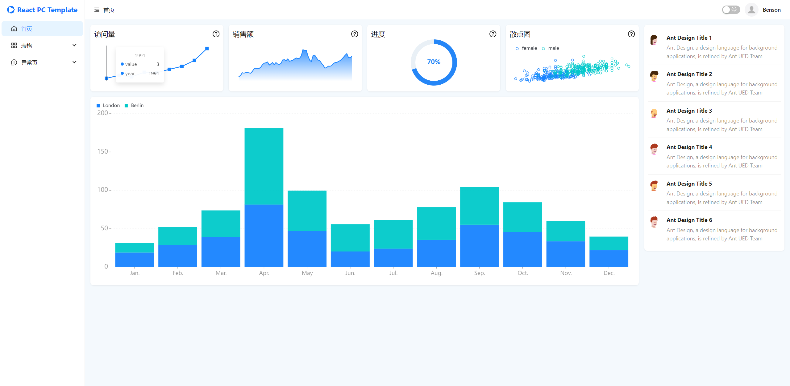
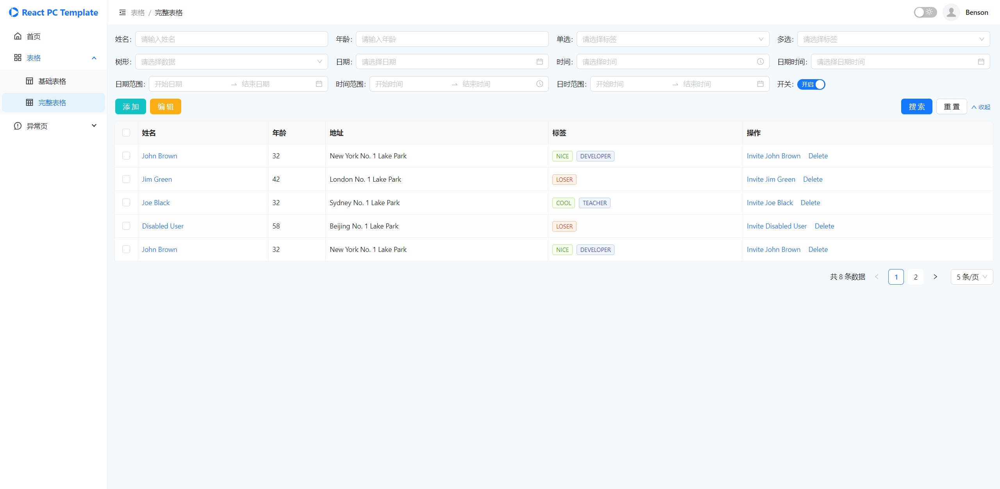
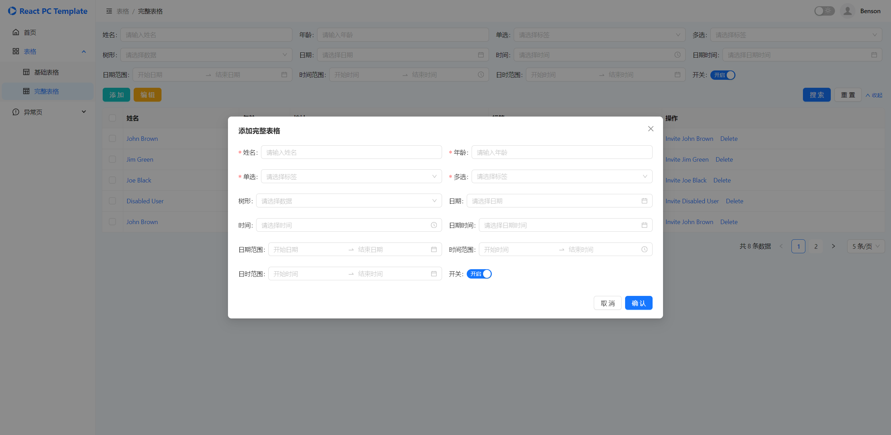

# React PC Template 后台管理模板

## 原项目

   基于项目 https://gitee.com/Dream_of/react-admin-template.git 进行二次开发，添加了动态菜单栏、动态路由、路由鉴权等功能，并优化了代码结构。

## 技术栈

* **构建工具：** Vite v5.4
* **前端技术：** React v18.3 + Zustand v4.5 + TypeScript v5.4
* **UI组件库：** Ant Design v5.22

## 功能特点

* 使用 React 作为核心框架，提供了强大的组件化开发能力
* 使用 Ant Design 作为 UI 组件库，提供了丰富的组件和样式
* 基于 Vite 构建，具有快速的开发启动速度和热模块替换，提升开发体验
* 集成 Mock 插件，提供请求模拟数据，方便前端开发者自行调试
* 友好的文件结构和代码注释，便于开发者理解和维护

## 运行截图








## 快速开始

1. **克隆项目**

```bash
git clone https://gitee.com/mj-project/react-pc-template.git

git pull origin master
git remote add github https://github.com/Kevin1573/react-pc-template.git
git push github master
```

2. **安装依赖**

```bash
cd react-pc-template
pnpm install
```

3. **启动**

```bash
pnpm dev
```

```bash
docker build -t react-app:latest .

docker run --name react-app -p 3000:80 -d react-app:latest
```

## 未来计划

1. 添加更多功能，如：菜单管理、角色管理、用户管理、日志管理、数据字典等
2. 封装常用组件，如：表格、表单、弹窗等

## 更新日志

* 2024-11-21：对表格相关组件做进一步优化以及功能扩充，新增用户管理页面
* 2024-11-15：添加了按钮颜色扩充组件、表格组件、条件搜索表单组件、弹窗表单组件
